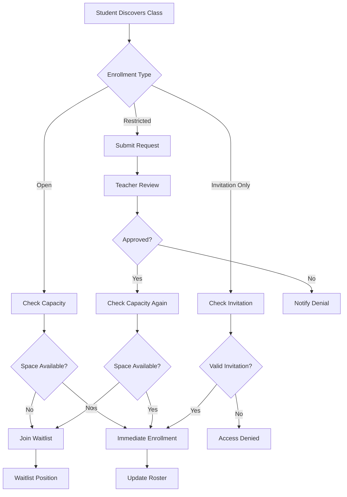
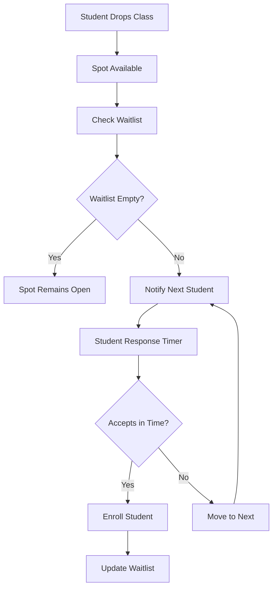

# Design Document

## Overview

The Class Enrollment Flow will implement a comprehensive enrollment management system that handles class discovery, enrollment requests, approval workflows, waitlist management, and roster administration. The design integrates with the existing class system and builds upon the institution/department structure to provide scalable enrollment management with proper access controls and notification systems.

## Architecture

### Enrollment Workflow


### Waitlist Management Flow


## Components and Interfaces

### Core Services

#### EnrollmentManager
```typescript
interface EnrollmentManager {
  requestEnrollment(studentId: string, classId: string): Promise<EnrollmentResult>;
  approveEnrollment(requestId: string, approverId: string): Promise<void>;
  denyEnrollment(requestId: string, approverId: string, reason: string): Promise<void>;
  dropStudent(studentId: string, classId: string, reason?: string): Promise<void>;
  transferStudent(studentId: string, fromClassId: string, toClassId: string): Promise<void>;
  bulkEnroll(studentIds: string[], classId: string): Promise<BulkEnrollmentResult>;
}
```

#### WaitlistManager
```typescript
interface WaitlistManager {
  addToWaitlist(studentId: string, classId: string): Promise<WaitlistEntry>;
  removeFromWaitlist(studentId: string, classId: string): Promise<void>;
  processWaitlist(classId: string): Promise<void>;
  getWaitlistPosition(studentId: string, classId: string): Promise<number>;
  estimateEnrollmentProbability(studentId: string, classId: string): Promise<number>;
  notifyWaitlistAdvancement(studentId: string, classId: string): Promise<void>;
}
```

#### ClassDiscoveryService
```typescript
interface ClassDiscoveryService {
  searchClasses(criteria: ClassSearchCriteria): Promise<ClassSearchResult[]>;
  getAvailableClasses(studentId: string): Promise<Class[]>;
  checkEnrollmentEligibility(studentId: string, classId: string): Promise<EligibilityResult>;
  getClassDetails(classId: string, studentId?: string): Promise<ClassDetails>;
  getEnrollmentStatistics(classId: string): Promise<EnrollmentStats>;
}
```

### Data Models

#### Enrollment Models
```typescript
interface Enrollment {
  id: string;
  studentId: string;
  classId: string;
  status: EnrollmentStatus;
  enrolledAt: Date;
  enrolledBy?: string; // For admin enrollments
  dropDeadline?: Date;
  grade?: string;
  credits: number;
  metadata: Record<string, any>;
}

enum EnrollmentStatus {
  ENROLLED = 'enrolled',
  PENDING = 'pending',
  WAITLISTED = 'waitlisted',
  DROPPED = 'dropped',
  WITHDRAWN = 'withdrawn',
  COMPLETED = 'completed'
}

interface EnrollmentRequest {
  id: string;
  studentId: string;
  classId: string;
  requestedAt: Date;
  status: 'pending' | 'approved' | 'denied' | 'expired';
  reviewedAt?: Date;
  reviewedBy?: string;
  reviewNotes?: string;
  justification?: string;
  priority: number;
}
```

#### Waitlist Models
```typescript
interface WaitlistEntry {
  id: string;
  studentId: string;
  classId: string;
  position: number;
  addedAt: Date;
  notifiedAt?: Date;
  expiresAt?: Date;
  priority: number;
  metadata: Record<string, any>;
}

interface WaitlistNotification {
  id: string;
  waitlistEntryId: string;
  notificationType: 'position_change' | 'enrollment_available' | 'deadline_reminder';
  sentAt: Date;
  responseDeadline?: Date;
  responded: boolean;
  response?: 'accept' | 'decline';
}
```

#### Class Configuration Models
```typescript
interface ClassEnrollmentConfig {
  classId: string;
  enrollmentType: 'open' | 'restricted' | 'invitation_only';
  capacity: number;
  waitlistCapacity?: number;
  enrollmentStart?: Date;
  enrollmentEnd?: Date;
  dropDeadline?: Date;
  withdrawDeadline?: Date;
  prerequisites: Prerequisite[];
  restrictions: EnrollmentRestriction[];
  autoApprove: boolean;
  requiresJustification: boolean;
}

interface Prerequisite {
  type: 'course' | 'grade' | 'year' | 'major' | 'custom';
  requirement: string;
  description: string;
  strict: boolean; // Whether to enforce automatically
}

interface EnrollmentRestriction {
  type: 'year_level' | 'major' | 'department' | 'gpa' | 'custom';
  condition: string;
  description: string;
  overridable: boolean;
}
```

### Database Schema

#### Enrollment Management Tables
```sql
-- Enhanced classes table with enrollment config
ALTER TABLE classes ADD COLUMN enrollment_config JSONB DEFAULT '{}';
ALTER TABLE classes ADD COLUMN capacity INTEGER DEFAULT 30;
ALTER TABLE classes ADD COLUMN current_enrollment INTEGER DEFAULT 0;
ALTER TABLE classes ADD COLUMN waitlist_capacity INTEGER DEFAULT 10;

-- Student enrollments
CREATE TABLE enrollments (
  id UUID PRIMARY KEY DEFAULT gen_random_uuid(),
  student_id UUID REFERENCES users(id) NOT NULL,
  class_id UUID REFERENCES classes(id) NOT NULL,
  status VARCHAR DEFAULT 'enrolled',
  enrolled_at TIMESTAMP DEFAULT NOW(),
  enrolled_by UUID REFERENCES users(id),
  drop_deadline DATE,
  grade VARCHAR,
  credits NUMERIC DEFAULT 0,
  metadata JSONB DEFAULT '{}',
  created_at TIMESTAMP DEFAULT NOW(),
  updated_at TIMESTAMP DEFAULT NOW(),
  UNIQUE(student_id, class_id)
);

-- Enrollment requests
CREATE TABLE enrollment_requests (
  id UUID PRIMARY KEY DEFAULT gen_random_uuid(),
  student_id UUID REFERENCES users(id) NOT NULL,
  class_id UUID REFERENCES classes(id) NOT NULL,
  requested_at TIMESTAMP DEFAULT NOW(),
  status VARCHAR DEFAULT 'pending',
  reviewed_at TIMESTAMP,
  reviewed_by UUID REFERENCES users(id),
  review_notes TEXT,
  justification TEXT,
  priority INTEGER DEFAULT 0,
  expires_at TIMESTAMP DEFAULT (NOW() + INTERVAL '7 days'),
  created_at TIMESTAMP DEFAULT NOW()
);

-- Waitlist management
CREATE TABLE waitlist_entries (
  id UUID PRIMARY KEY DEFAULT gen_random_uuid(),
  student_id UUID REFERENCES users(id) NOT NULL,
  class_id UUID REFERENCES classes(id) NOT NULL,
  position INTEGER NOT NULL,
  added_at TIMESTAMP DEFAULT NOW(),
  notified_at TIMESTAMP,
  expires_at TIMESTAMP,
  priority INTEGER DEFAULT 0,
  metadata JSONB DEFAULT '{}',
  UNIQUE(student_id, class_id)
);

-- Waitlist notifications
CREATE TABLE waitlist_notifications (
  id UUID PRIMARY KEY DEFAULT gen_random_uuid(),
  waitlist_entry_id UUID REFERENCES waitlist_entries(id) NOT NULL,
  notification_type VARCHAR NOT NULL,
  sent_at TIMESTAMP DEFAULT NOW(),
  response_deadline TIMESTAMP,
  responded BOOLEAN DEFAULT FALSE,
  response VARCHAR,
  created_at TIMESTAMP DEFAULT NOW()
);

-- Class prerequisites
CREATE TABLE class_prerequisites (
  id UUID PRIMARY KEY DEFAULT gen_random_uuid(),
  class_id UUID REFERENCES classes(id) NOT NULL,
  type VARCHAR NOT NULL,
  requirement TEXT NOT NULL,
  description TEXT,
  strict BOOLEAN DEFAULT TRUE,
  created_at TIMESTAMP DEFAULT NOW()
);

-- Enrollment restrictions
CREATE TABLE enrollment_restrictions (
  id UUID PRIMARY KEY DEFAULT gen_random_uuid(),
  class_id UUID REFERENCES classes(id) NOT NULL,
  type VARCHAR NOT NULL,
  condition TEXT NOT NULL,
  description TEXT,
  overridable BOOLEAN DEFAULT FALSE,
  created_at TIMESTAMP DEFAULT NOW()
);

-- Enrollment audit log
CREATE TABLE enrollment_audit_log (
  id UUID PRIMARY KEY DEFAULT gen_random_uuid(),
  student_id UUID REFERENCES users(id) NOT NULL,
  class_id UUID REFERENCES classes(id) NOT NULL,
  action VARCHAR NOT NULL, -- 'enrolled', 'dropped', 'waitlisted', 'approved', 'denied'
  performed_by UUID REFERENCES users(id),
  reason TEXT,
  timestamp TIMESTAMP DEFAULT NOW(),
  metadata JSONB DEFAULT '{}'
);

-- Class invitations
CREATE TABLE class_invitations (
  id UUID PRIMARY KEY DEFAULT gen_random_uuid(),
  class_id UUID REFERENCES classes(id) NOT NULL,
  student_id UUID REFERENCES users(id),
  email VARCHAR,
  invited_by UUID REFERENCES users(id) NOT NULL,
  token VARCHAR UNIQUE NOT NULL,
  expires_at TIMESTAMP NOT NULL,
  accepted_at TIMESTAMP,
  created_at TIMESTAMP DEFAULT NOW()
);
```

### API Design

#### Enrollment Management Endpoints
```typescript
// Class discovery and search
GET /api/classes/search
GET /api/classes/available
GET /api/classes/:id/details
GET /api/classes/:id/enrollment-stats

// Enrollment operations
POST /api/enrollments/request
PUT /api/enrollment-requests/:id/approve
PUT /api/enrollment-requests/:id/deny
DELETE /api/enrollments/:id (drop/withdraw)
POST /api/enrollments/bulk

// Waitlist management
POST /api/waitlists/:classId/join
DELETE /api/waitlists/:classId/leave
GET /api/waitlists/:classId/position
POST /api/waitlists/:classId/process

// Class configuration
GET /api/classes/:id/enrollment-config
PUT /api/classes/:id/enrollment-config
POST /api/classes/:id/prerequisites
POST /api/classes/:id/restrictions

// Invitations
POST /api/classes/:id/invitations
GET /api/invitations/:token/details
POST /api/invitations/:token/accept

// Analytics and reporting
GET /api/enrollments/analytics
GET /api/classes/:id/roster
GET /api/enrollments/audit
```

## Error Handling

### Enrollment Validation
- Capacity limit enforcement with race condition handling
- Prerequisite validation with flexible override options
- Duplicate enrollment prevention
- Enrollment deadline enforcement
- Academic calendar integration

### Waitlist Management
- Position calculation accuracy
- Notification delivery reliability
- Response timeout handling
- Automatic promotion processing
- Capacity change adaptation

### Data Consistency
- Enrollment count synchronization
- Waitlist position maintenance
- Audit trail completeness
- Transaction handling for complex operations

## Testing Strategy

### Unit Testing
- Enrollment eligibility checking logic
- Waitlist position calculation accuracy
- Prerequisite validation algorithms
- Capacity management functions

### Integration Testing
- Complete enrollment workflow testing
- Waitlist promotion automation
- Notification delivery systems
- Multi-user concurrent enrollment scenarios

### Performance Testing
- High-volume enrollment processing
- Waitlist management scalability
- Search and discovery performance
- Notification system load testing

### User Experience Testing
- Enrollment flow usability
- Mobile responsiveness
- Accessibility compliance
- Error message clarity

## Implementation Considerations

### Scalability Planning
- Database indexing for enrollment queries
- Caching strategies for class discovery
- Queue management for waitlist processing
- Notification system optimization

### Real-time Features
- Live enrollment count updates
- Instant waitlist position changes
- Real-time availability notifications
- Concurrent enrollment handling

### Integration Points
- Academic calendar system integration
- Student information system synchronization
- Grade book integration
- Communication platform connectivity

### Mobile Optimization
- Mobile-first enrollment interface
- Push notification support
- Offline capability for class browsing
- Touch-optimized interaction design

## Security Considerations

### Access Control
- Student data privacy protection
- Instructor roster access controls
- Administrative override logging
- Cross-institutional enrollment restrictions

### Data Protection
- Enrollment history preservation
- Audit trail immutability
- Personal information handling
- FERPA compliance for educational records

### Fraud Prevention
- Enrollment request validation
- Suspicious activity detection
- Rate limiting for enrollment attempts
- Identity verification for sensitive operations