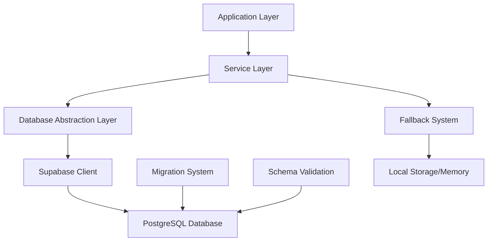
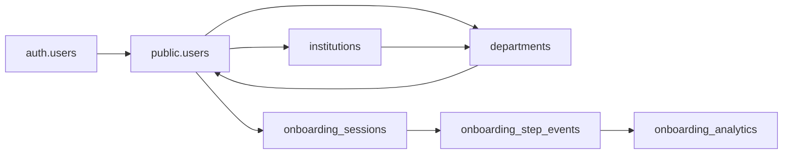

# Database Schema Setup Design

## Overview

This design addresses the critical database schema issues preventing the onboarding system from functioning. The application currently fails because required tables (`users`, `onboarding_sessions`, etc.) don't exist in the Supabase database, causing PGRST205 errors and blank onboarding pages.

## Architecture

### Database Layer Architecture



### Schema Dependencies



## Components and Interfaces

### 1. Database Schema Components

#### Core Tables Schema

```sql
-- Users table (main user profiles)
CREATE TABLE public.users (
  id UUID PRIMARY KEY REFERENCES auth.users(id) ON DELETE CASCADE,
  email TEXT UNIQUE NOT NULL,
  role TEXT NOT NULL DEFAULT 'student',
  first_name TEXT,
  last_name TEXT,
  institution_id UUID REFERENCES institutions(id),
  department_id UUID REFERENCES departments(id),
  onboarding_completed BOOLEAN DEFAULT FALSE,
  onboarding_data JSONB,
  created_at TIMESTAMPTZ DEFAULT NOW(),
  updated_at TIMESTAMPTZ DEFAULT NOW()
);

-- Institutions table
CREATE TABLE public.institutions (
  id UUID PRIMARY KEY DEFAULT gen_random_uuid(),
  name TEXT NOT NULL,
  domain TEXT,
  subdomain TEXT UNIQUE,
  type TEXT NOT NULL DEFAULT 'university',
  status TEXT NOT NULL DEFAULT 'active',
  contact_email TEXT,
  contact_phone TEXT,
  address JSONB,
  settings JSONB DEFAULT '{}',
  branding JSONB DEFAULT '{}',
  created_at TIMESTAMPTZ DEFAULT NOW(),
  updated_at TIMESTAMPTZ DEFAULT NOW(),
  created_by UUID REFERENCES users(id)
);

-- Departments table
CREATE TABLE public.departments (
  id UUID PRIMARY KEY DEFAULT gen_random_uuid(),
  institution_id UUID NOT NULL REFERENCES institutions(id) ON DELETE CASCADE,
  name TEXT NOT NULL,
  description TEXT,
  code TEXT,
  admin_id UUID REFERENCES users(id),
  parent_department_id UUID REFERENCES departments(id),
  settings JSONB DEFAULT '{}',
  status TEXT NOT NULL DEFAULT 'active',
  created_at TIMESTAMPTZ DEFAULT NOW(),
  updated_at TIMESTAMPTZ DEFAULT NOW()
);

-- Onboarding sessions table
CREATE TABLE public.onboarding_sessions (
  id UUID PRIMARY KEY DEFAULT gen_random_uuid(),
  user_id UUID NOT NULL REFERENCES users(id) ON DELETE CASCADE,
  current_step INTEGER NOT NULL DEFAULT 0,
  total_steps INTEGER NOT NULL DEFAULT 5,
  data JSONB NOT NULL DEFAULT '{}',
  started_at TIMESTAMPTZ DEFAULT NOW(),
  completed_at TIMESTAMPTZ,
  last_activity TIMESTAMPTZ DEFAULT NOW()
);

-- Onboarding step events (for analytics)
CREATE TABLE public.onboarding_step_events (
  id UUID PRIMARY KEY DEFAULT gen_random_uuid(),
  session_id UUID NOT NULL REFERENCES onboarding_sessions(id) ON DELETE CASCADE,
  step_name TEXT NOT NULL,
  step_number INTEGER NOT NULL,
  event_type TEXT NOT NULL, -- 'started', 'completed', 'skipped', 'abandoned'
  event_data JSONB DEFAULT '{}',
  timestamp TIMESTAMPTZ DEFAULT NOW()
);

-- Onboarding analytics (aggregated data)
CREATE TABLE public.onboarding_analytics (
  id UUID PRIMARY KEY DEFAULT gen_random_uuid(),
  date DATE NOT NULL,
  role TEXT,
  institution_id UUID REFERENCES institutions(id),
  total_started INTEGER DEFAULT 0,
  total_completed INTEGER DEFAULT 0,
  completion_rate DECIMAL(5,2) DEFAULT 0,
  average_completion_time INTEGER DEFAULT 0, -- in minutes
  created_at TIMESTAMPTZ DEFAULT NOW()
);
```

#### Row Level Security (RLS) Policies

```sql
-- Enable RLS on all tables
ALTER TABLE users ENABLE ROW LEVEL SECURITY;
ALTER TABLE institutions ENABLE ROW LEVEL SECURITY;
ALTER TABLE departments ENABLE ROW LEVEL SECURITY;
ALTER TABLE onboarding_sessions ENABLE ROW LEVEL SECURITY;
ALTER TABLE onboarding_step_events ENABLE ROW LEVEL SECURITY;
ALTER TABLE onboarding_analytics ENABLE ROW LEVEL SECURITY;

-- Users can read/update their own profile
CREATE POLICY "Users can view own profile" ON users
  FOR SELECT USING (auth.uid() = id);

CREATE POLICY "Users can update own profile" ON users
  FOR UPDATE USING (auth.uid() = id);

-- Onboarding sessions policies
CREATE POLICY "Users can manage own onboarding" ON onboarding_sessions
  FOR ALL USING (auth.uid() = user_id);

-- Public read access for institutions and departments
CREATE POLICY "Anyone can view institutions" ON institutions
  FOR SELECT USING (status = 'active');

CREATE POLICY "Anyone can view departments" ON departments
  FOR SELECT USING (status = 'active');
```

### 2. Migration System

#### Migration Manager Interface

```typescript
interface MigrationManager {
  checkSchemaExists(): Promise<boolean>;
  runMigrations(): Promise<MigrationResult>;
  validateSchema(): Promise<ValidationResult>;
  createFallbackTables(): Promise<void>;
}

interface MigrationResult {
  success: boolean;
  migrationsRun: string[];
  errors: string[];
  warnings: string[];
}
```

#### Migration Strategy

1. **Detection Phase**: Check which tables exist
2. **Analysis Phase**: Determine what migrations are needed
3. **Execution Phase**: Run migrations in dependency order
4. **Validation Phase**: Verify schema integrity
5. **Fallback Phase**: Create minimal tables if migrations fail

### 3. Service Layer Adaptations

#### Database Service Interface

```typescript
interface DatabaseService {
  // Core operations
  getUser(id: string): Promise<User | null>;
  createUser(userData: CreateUserData): Promise<User>;
  updateUser(id: string, updates: Partial<User>): Promise<User>;
  
  // Onboarding operations
  getOnboardingSession(userId: string): Promise<OnboardingSession | null>;
  createOnboardingSession(userId: string): Promise<OnboardingSession>;
  updateOnboardingSession(userId: string, updates: Partial<OnboardingSession>): Promise<OnboardingSession>;
  
  // Institution/Department operations
  searchInstitutions(query: string): Promise<Institution[]>;
  getDepartmentsByInstitution(institutionId: string): Promise<Department[]>;
  
  // Fallback mode
  enableFallbackMode(): void;
  isInFallbackMode(): boolean;
}
```

### 4. Fallback System

#### Fallback Data Storage

```typescript
interface FallbackStorage {
  // Local storage for when database is unavailable
  storeUserData(userId: string, data: any): void;
  getUserData(userId: string): any | null;
  storeOnboardingSession(userId: string, session: OnboardingSession): void;
  getOnboardingSession(userId: string): OnboardingSession | null;
  
  // Sync with database when available
  syncToDatabase(): Promise<SyncResult>;
  hasPendingSync(): boolean;
}
```

## Data Models

### Enhanced User Model

```typescript
interface User {
  id: string;
  email: string;
  role: UserRole;
  firstName?: string;
  lastName?: string;
  institutionId?: string;
  departmentId?: string;
  onboardingCompleted: boolean;
  onboardingData?: OnboardingData;
  createdAt: Date;
  updatedAt: Date;
}
```

### Migration Configuration

```typescript
interface MigrationConfig {
  version: string;
  migrations: Migration[];
  fallbackEnabled: boolean;
  retryAttempts: number;
  timeoutMs: number;
}

interface Migration {
  id: string;
  name: string;
  sql: string;
  rollback?: string;
  dependencies: string[];
}
```

## Error Handling

### Database Error Categories

1. **Connection Errors**: Network/authentication issues
2. **Schema Errors**: Missing tables/columns
3. **Permission Errors**: RLS policy violations
4. **Data Errors**: Constraint violations, invalid data
5. **Migration Errors**: Failed schema updates

### Error Recovery Strategies

```typescript
interface ErrorRecoveryStrategy {
  canHandle(error: DatabaseError): boolean;
  recover(error: DatabaseError): Promise<RecoveryResult>;
}

class SchemaErrorRecovery implements ErrorRecoveryStrategy {
  async recover(error: DatabaseError): Promise<RecoveryResult> {
    if (error.code === 'PGRST205') {
      // Table not found - attempt to create or use fallback
      return await this.handleMissingTable(error);
    }
    return { success: false, fallbackUsed: false };
  }
}
```

## Testing Strategy

### Database Testing Approach

1. **Unit Tests**: Individual service methods with mocked database
2. **Integration Tests**: Full database operations with test database
3. **Migration Tests**: Schema creation and updates
4. **Fallback Tests**: Behavior when database is unavailable
5. **Performance Tests**: Query performance and connection handling

### Test Database Setup

```typescript
interface TestDatabaseSetup {
  createTestDatabase(): Promise<void>;
  seedTestData(): Promise<void>;
  cleanupTestDatabase(): Promise<void>;
  runMigrationTests(): Promise<TestResult[]>;
}
```

## Implementation Phases

### Phase 1: Critical Schema Setup
- Create core tables (users, institutions, departments)
- Implement basic RLS policies
- Set up user profile creation trigger

### Phase 2: Onboarding System Tables
- Create onboarding_sessions table
- Implement onboarding service database operations
- Add session persistence and recovery

### Phase 3: Analytics and Tracking
- Create analytics tables
- Implement event tracking
- Add aggregation functions

### Phase 4: Migration and Fallback Systems
- Build migration manager
- Implement fallback storage
- Add automatic schema validation

### Phase 5: Optimization and Monitoring
- Add database performance monitoring
- Implement query optimization
- Set up automated backups and maintenance

## Security Considerations

### Data Protection
- All user data encrypted at rest
- RLS policies prevent unauthorized access
- Audit logging for sensitive operations
- GDPR compliance for user data deletion

### Access Control
- Role-based access to administrative functions
- Institution-scoped data access
- API rate limiting and authentication
- Secure migration execution

This design provides a comprehensive solution to the database schema issues while ensuring the application remains functional and user-friendly even when database operations fail.