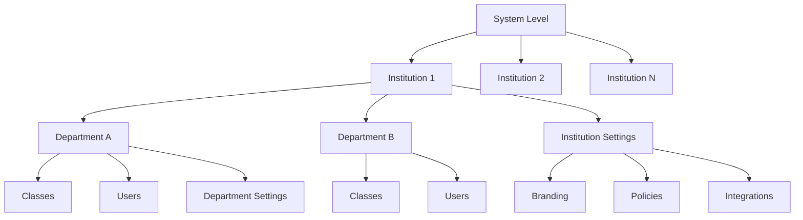
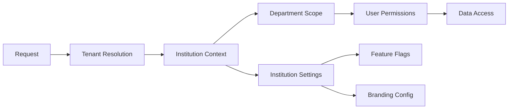

# Design Document

## Overview

The Institution/Department Setup Flow will implement a comprehensive institutional management system that handles institution onboarding, configuration, department organization, user management, and administrative oversight. The design integrates with existing authentication and role management systems while providing scalable multi-tenancy support.

## Architecture

### Institution Hierarchy


### Multi-Tenant Data Architecture


## Components and Interfaces

### Core Services

#### InstitutionManager
```typescript
interface InstitutionManager {
  createInstitution(data: InstitutionCreationData): Promise<Institution>;
  updateInstitution(id: string, updates: Partial<Institution>): Promise<Institution>;
  deleteInstitution(id: string): Promise<void>;
  getInstitution(id: string): Promise<Institution>;
  listInstitutions(filters?: InstitutionFilters): Promise<Institution[]>;
  validateInstitutionDomain(domain: string): Promise<boolean>;
}
```

#### DepartmentManager
```typescript
interface DepartmentManager {
  createDepartment(institutionId: string, data: DepartmentCreationData): Promise<Department>;
  updateDepartment(id: string, updates: Partial<Department>): Promise<Department>;
  deleteDepartment(id: string, transferData?: boolean): Promise<void>;
  getDepartment(id: string): Promise<Department>;
  listDepartments(institutionId: string): Promise<Department[]>;
  transferUsers(fromDeptId: string, toDeptId: string): Promise<void>;
}
```

#### InstitutionConfigManager
```typescript
interface InstitutionConfigManager {
  getConfig(institutionId: string): Promise<InstitutionConfig>;
  updateConfig(institutionId: string, config: Partial<InstitutionConfig>): Promise<void>;
  getBranding(institutionId: string): Promise<BrandingConfig>;
  updateBranding(institutionId: string, branding: BrandingConfig): Promise<void>;
  getFeatureFlags(institutionId: string): Promise<FeatureFlags>;
  updateFeatureFlags(institutionId: string, flags: FeatureFlags): Promise<void>;
}
```

### Data Models

#### Institution Model
```typescript
interface Institution {
  id: string;
  name: string;
  domain: string;
  subdomain?: string;
  type: 'university' | 'college' | 'school' | 'training_center' | 'other';
  status: 'active' | 'inactive' | 'suspended' | 'pending';
  contactInfo: ContactInfo;
  address: Address;
  settings: InstitutionSettings;
  branding: BrandingConfig;
  subscription: SubscriptionInfo;
  createdAt: Date;
  updatedAt: Date;
  createdBy: string;
}

interface InstitutionSettings {
  allowSelfRegistration: boolean;
  requireEmailVerification: boolean;
  defaultUserRole: UserRole;
  allowCrossInstitutionCollaboration: boolean;
  contentSharingPolicy: ContentSharingPolicy;
  dataRetentionPolicy: DataRetentionPolicy;
  integrations: IntegrationConfig[];
  customFields: CustomField[];
}
```

#### Department Model
```typescript
interface Department {
  id: string;
  institutionId: string;
  name: string;
  description: string;
  code: string; // e.g., "CS", "MATH", "ENG"
  adminId: string;
  settings: DepartmentSettings;
  parentDepartmentId?: string; // For hierarchical departments
  status: 'active' | 'inactive' | 'archived';
  createdAt: Date;
  updatedAt: Date;
}

interface DepartmentSettings {
  defaultClassSettings: ClassSettings;
  gradingPolicies: GradingPolicy[];
  assignmentDefaults: AssignmentDefaults;
  collaborationRules: CollaborationRules;
  customFields: CustomField[];
}
```

#### Configuration Models
```typescript
interface BrandingConfig {
  logo?: string;
  favicon?: string;
  primaryColor: string;
  secondaryColor: string;
  accentColor: string;
  fontFamily?: string;
  customCSS?: string;
  welcomeMessage?: string;
  footerText?: string;
}

interface IntegrationConfig {
  type: 'sso' | 'sis' | 'lms' | 'analytics' | 'storage';
  provider: string;
  config: Record<string, any>;
  enabled: boolean;
  lastSync?: Date;
  syncErrors?: string[];
}

interface SubscriptionInfo {
  plan: 'free' | 'basic' | 'premium' | 'enterprise';
  userLimit: number;
  storageLimit: number; // in GB
  features: string[];
  billingCycle: 'monthly' | 'yearly';
  nextBillingDate: Date;
  status: 'active' | 'past_due' | 'cancelled' | 'trial';
}
```

### Database Schema

#### Institution Management Tables
```sql
-- Enhanced institutions table
CREATE TABLE institutions (
  id UUID PRIMARY KEY DEFAULT gen_random_uuid(),
  name VARCHAR NOT NULL,
  domain VARCHAR UNIQUE NOT NULL,
  subdomain VARCHAR UNIQUE,
  type VARCHAR DEFAULT 'university',
  status VARCHAR DEFAULT 'active',
  contact_email VARCHAR,
  contact_phone VARCHAR,
  address JSONB,
  settings JSONB DEFAULT '{}',
  branding JSONB DEFAULT '{}',
  subscription JSONB DEFAULT '{}',
  created_at TIMESTAMP DEFAULT NOW(),
  updated_at TIMESTAMP DEFAULT NOW(),
  created_by UUID REFERENCES users(id)
);

-- Enhanced departments table
CREATE TABLE departments (
  id UUID PRIMARY KEY DEFAULT gen_random_uuid(),
  institution_id UUID REFERENCES institutions(id) NOT NULL,
  name VARCHAR NOT NULL,
  description TEXT,
  code VARCHAR,
  admin_id UUID REFERENCES users(id),
  parent_department_id UUID REFERENCES departments(id),
  settings JSONB DEFAULT '{}',
  status VARCHAR DEFAULT 'active',
  created_at TIMESTAMP DEFAULT NOW(),
  updated_at TIMESTAMP DEFAULT NOW(),
  UNIQUE(institution_id, code)
);

-- Institution integrations
CREATE TABLE institution_integrations (
  id UUID PRIMARY KEY DEFAULT gen_random_uuid(),
  institution_id UUID REFERENCES institutions(id) NOT NULL,
  type VARCHAR NOT NULL,
  provider VARCHAR NOT NULL,
  config JSONB NOT NULL,
  enabled BOOLEAN DEFAULT TRUE,
  last_sync TIMESTAMP,
  sync_errors TEXT[],
  created_at TIMESTAMP DEFAULT NOW(),
  updated_at TIMESTAMP DEFAULT NOW()
);

-- Institution analytics
CREATE TABLE institution_analytics (
  id UUID PRIMARY KEY DEFAULT gen_random_uuid(),
  institution_id UUID REFERENCES institutions(id) NOT NULL,
  metric_name VARCHAR NOT NULL,
  metric_value NUMERIC,
  metadata JSONB DEFAULT '{}',
  recorded_at TIMESTAMP DEFAULT NOW(),
  date_bucket DATE DEFAULT CURRENT_DATE
);

-- Department analytics
CREATE TABLE department_analytics (
  id UUID PRIMARY KEY DEFAULT gen_random_uuid(),
  department_id UUID REFERENCES departments(id) NOT NULL,
  metric_name VARCHAR NOT NULL,
  metric_value NUMERIC,
  metadata JSONB DEFAULT '{}',
  recorded_at TIMESTAMP DEFAULT NOW(),
  date_bucket DATE DEFAULT CURRENT_DATE
);

-- Institution invitations
CREATE TABLE institution_invitations (
  id UUID PRIMARY KEY DEFAULT gen_random_uuid(),
  institution_id UUID REFERENCES institutions(id) NOT NULL,
  email VARCHAR NOT NULL,
  role VARCHAR NOT NULL,
  department_id UUID REFERENCES departments(id),
  invited_by UUID REFERENCES users(id) NOT NULL,
  token VARCHAR UNIQUE NOT NULL,
  expires_at TIMESTAMP NOT NULL,
  accepted_at TIMESTAMP,
  created_at TIMESTAMP DEFAULT NOW()
);

-- Content sharing policies
CREATE TABLE content_sharing_policies (
  id UUID PRIMARY KEY DEFAULT gen_random_uuid(),
  institution_id UUID REFERENCES institutions(id) NOT NULL,
  resource_type VARCHAR NOT NULL,
  sharing_level VARCHAR NOT NULL, -- 'private', 'department', 'institution', 'public'
  conditions JSONB DEFAULT '{}',
  created_at TIMESTAMP DEFAULT NOW(),
  updated_at TIMESTAMP DEFAULT NOW()
);
```

### API Design

#### Institution Management Endpoints
```typescript
// Institution CRUD
POST /api/institutions
GET /api/institutions/:id
PUT /api/institutions/:id
DELETE /api/institutions/:id
GET /api/institutions (with filtering and pagination)

// Institution configuration
GET /api/institutions/:id/config
PUT /api/institutions/:id/config
GET /api/institutions/:id/branding
PUT /api/institutions/:id/branding

// Department management
POST /api/institutions/:id/departments
GET /api/institutions/:id/departments
PUT /api/departments/:id
DELETE /api/departments/:id

// User management
GET /api/institutions/:id/users
POST /api/institutions/:id/invitations
PUT /api/institutions/:id/users/:userId/role

// Analytics and reporting
GET /api/institutions/:id/analytics
GET /api/departments/:id/analytics
POST /api/institutions/:id/reports/generate

// Integrations
GET /api/institutions/:id/integrations
POST /api/institutions/:id/integrations
PUT /api/integrations/:id
DELETE /api/integrations/:id
POST /api/integrations/:id/sync
```

## Error Handling

### Validation Strategy
- Institution domain uniqueness validation
- Department code uniqueness within institution
- Hierarchical department validation (prevent circular references)
- Configuration validation against institution policies
- Integration configuration validation

### Multi-Tenancy Considerations
- Tenant isolation at database level
- Cross-tenant data access prevention
- Tenant-specific feature flag enforcement
- Resource quota enforcement per institution

### Data Consistency
- Transaction handling for complex operations
- Cascade deletion with user confirmation
- Data migration utilities for structural changes
- Backup and restore capabilities

## Testing Strategy

### Unit Testing
- Institution and department CRUD operations
- Configuration validation logic
- Analytics calculation accuracy
- Integration configuration validation

### Integration Testing
- Multi-tenant data isolation
- Cross-institution collaboration workflows
- SSO integration flows
- Bulk user import processes

### Performance Testing
- Large institution user management
- Analytics query performance
- Multi-tenant database performance
- Integration sync performance

### Security Testing
- Tenant data isolation validation
- Admin privilege escalation prevention
- Integration security validation
- Data export security compliance

## Implementation Considerations

### Scalability Planning
- Database sharding strategies for large institutions
- Caching strategies for configuration data
- Analytics data aggregation and archival
- Integration rate limiting and queuing

### Migration Strategy
- Existing data migration to multi-tenant structure
- Gradual feature rollout per institution
- Backward compatibility during transition
- Data validation and integrity checks

### Monitoring and Alerting
- Institution health monitoring
- Integration failure detection
- Usage quota monitoring
- Performance metric tracking

### Compliance and Security
- GDPR compliance for EU institutions
- FERPA compliance for US educational institutions
- SOC 2 compliance for enterprise customers
- Data encryption at rest and in transit

## User Experience Design

### Admin Interfaces
- Institution setup wizard for new institutions
- Department management dashboard
- User invitation and management interface
- Analytics and reporting dashboards

### Branding and Customization
- Visual theme customization interface
- Custom domain setup workflow
- Email template customization
- Mobile app branding options

### Self-Service Capabilities
- Department admin self-service tools
- User self-registration workflows
- Integration setup wizards
- Billing and subscription management