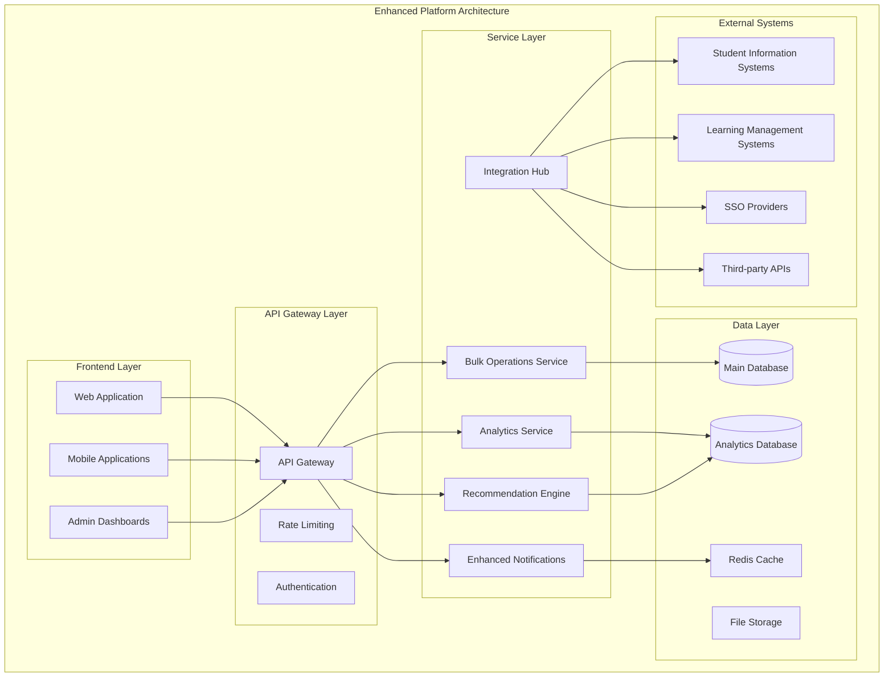
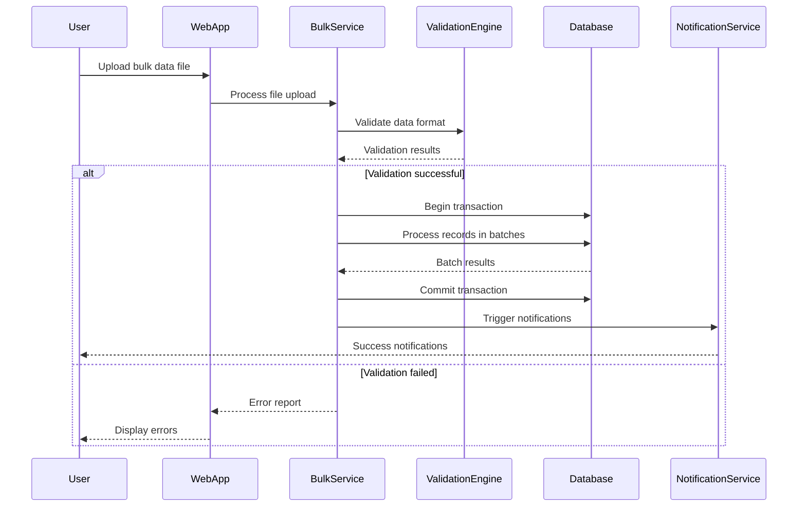

# Design Document

## Overview

The Post-Deployment Enhancements design addresses the critical functionality gaps identified during deployment readiness assessment and incorporates improvements based on anticipated user feedback. This design focuses on operational efficiency, user experience optimization, and platform scalability while maintaining the existing architecture's integrity.

## Architecture

### System Architecture Enhancements



### Data Flow Architecture



## Components and Interfaces

### 1. Bulk Operations Service

#### BulkUserImportService
```typescript
interface BulkUserImportService {
  validateFile(file: File): Promise<ValidationResult>;
  processImport(file: File, options: ImportOptions): Promise<ImportResult>;
  getImportStatus(importId: string): Promise<ImportStatus>;
  rollbackImport(importId: string): Promise<RollbackResult>;
}

interface ImportOptions {
  institutionId: string;
  defaultRole?: UserRole;
  sendWelcomeEmails: boolean;
  dryRun: boolean;
  batchSize: number;
}

interface ImportResult {
  importId: string;
  totalRecords: number;
  successfulImports: number;
  failedImports: number;
  errors: ImportError[];
  summary: ImportSummary;
}
```

#### BulkRoleAssignmentService
```typescript
interface BulkRoleAssignmentService {
  assignRolesToUsers(assignment: BulkRoleAssignment): Promise<BulkAssignmentResult>;
  validateBulkAssignment(assignment: BulkRoleAssignment): Promise<ValidationResult>;
  getBulkAssignmentStatus(assignmentId: string): Promise<AssignmentStatus>;
}

interface BulkRoleAssignment {
  userIds: string[];
  role: UserRole;
  assignedBy: string;
  institutionId: string;
  departmentId?: string;
  isTemporary: boolean;
  expiresAt?: Date;
  justification: string;
}
```

### 2. Enhanced Analytics Service

#### AnalyticsEngine
```typescript
interface AnalyticsEngine {
  generateRealTimeMetrics(): Promise<RealTimeMetrics>;
  createCustomDashboard(config: DashboardConfig): Promise<Dashboard>;
  generatePredictiveAnalytics(query: AnalyticsQuery): Promise<PredictiveResults>;
  scheduleReport(report: ReportConfig): Promise<ScheduledReport>;
}

interface RealTimeMetrics {
  activeUsers: number;
  systemPerformance: PerformanceMetrics;
  userActivity: ActivityMetrics;
  errorRates: ErrorMetrics;
  alerts: SystemAlert[];
}

interface DashboardConfig {
  widgets: WidgetConfig[];
  layout: LayoutConfig;
  permissions: AccessPermissions;
  refreshInterval: number;
}
```

### 3. Recommendation Engine

#### PersonalizationService
```typescript
interface PersonalizationService {
  getPersonalizedRecommendations(userId: string): Promise<Recommendation[]>;
  updateUserPreferences(userId: string, preferences: UserPreferences): Promise<void>;
  trackUserInteraction(interaction: UserInteraction): Promise<void>;
  generateInsights(userId: string): Promise<UserInsights>;
}

interface Recommendation {
  type: RecommendationType;
  title: string;
  description: string;
  relevanceScore: number;
  actionUrl: string;
  reasoning: string;
  metadata: Record<string, any>;
}

enum RecommendationType {
  CLASS_SUGGESTION = 'class_suggestion',
  ROLE_CHANGE = 'role_change',
  FEATURE_TIP = 'feature_tip',
  CONTENT_DISCOVERY = 'content_discovery'
}
```

### 4. Enhanced Notification System

#### NotificationTemplateService
```typescript
interface NotificationTemplateService {
  createTemplate(template: NotificationTemplate): Promise<Template>;
  customizeTemplate(templateId: string, customization: TemplateCustomization): Promise<Template>;
  previewTemplate(templateId: string, data: TemplateData): Promise<TemplatePreview>;
  testTemplate(templateId: string, recipients: string[]): Promise<TestResult>;
}

interface NotificationTemplate {
  name: string;
  type: NotificationType;
  subject: string;
  htmlContent: string;
  textContent: string;
  variables: TemplateVariable[];
  conditions: TemplateCondition[];
}

interface TemplateCustomization {
  branding: BrandingConfig;
  styling: StyleConfig;
  content: ContentOverrides;
  scheduling: SchedulingConfig;
}
```

### 5. Mobile Application Architecture

#### Mobile App Components
```typescript
interface MobileAppService {
  syncOfflineData(): Promise<SyncResult>;
  cacheEssentialData(): Promise<CacheResult>;
  handlePushNotifications(notification: PushNotification): Promise<void>;
  optimizeForPlatform(platform: MobilePlatform): Promise<OptimizationResult>;
}

interface OfflineCapabilities {
  cachedContent: CachedContent[];
  offlineActions: OfflineAction[];
  syncQueue: SyncQueueItem[];
  conflictResolution: ConflictResolutionStrategy;
}
```

### 6. Integration Hub

#### IntegrationManager
```typescript
interface IntegrationManager {
  configureIntegration(config: IntegrationConfig): Promise<Integration>;
  testIntegration(integrationId: string): Promise<TestResult>;
  monitorIntegrationHealth(): Promise<HealthStatus[]>;
  handleWebhook(webhook: WebhookPayload): Promise<WebhookResponse>;
}

interface IntegrationConfig {
  type: IntegrationType;
  credentials: IntegrationCredentials;
  mappings: DataMapping[];
  syncSchedule: SyncSchedule;
  errorHandling: ErrorHandlingConfig;
}

enum IntegrationType {
  SIS = 'student_information_system',
  LMS = 'learning_management_system',
  SSO = 'single_sign_on',
  CUSTOM_API = 'custom_api'
}
```

## Data Models

### Enhanced Data Models

#### Bulk Import Models
```sql
-- Bulk import tracking
CREATE TABLE bulk_imports (
  id UUID PRIMARY KEY DEFAULT gen_random_uuid(),
  institution_id UUID NOT NULL,
  initiated_by UUID NOT NULL,
  file_name VARCHAR NOT NULL,
  file_size BIGINT NOT NULL,
  total_records INTEGER NOT NULL,
  processed_records INTEGER DEFAULT 0,
  successful_records INTEGER DEFAULT 0,
  failed_records INTEGER DEFAULT 0,
  status VARCHAR DEFAULT 'processing',
  started_at TIMESTAMP DEFAULT NOW(),
  completed_at TIMESTAMP,
  error_report JSONB DEFAULT '{}',
  metadata JSONB DEFAULT '{}',
  
  CONSTRAINT fk_bulk_imports_institution FOREIGN KEY (institution_id) REFERENCES institutions(id),
  CONSTRAINT fk_bulk_imports_user FOREIGN KEY (initiated_by) REFERENCES users(id),
  CONSTRAINT chk_bulk_imports_status CHECK (status IN ('processing', 'completed', 'failed', 'cancelled'))
);

-- Import error tracking
CREATE TABLE import_errors (
  id UUID PRIMARY KEY DEFAULT gen_random_uuid(),
  import_id UUID NOT NULL,
  row_number INTEGER NOT NULL,
  error_type VARCHAR NOT NULL,
  error_message TEXT NOT NULL,
  raw_data JSONB NOT NULL,
  suggested_fix TEXT,
  created_at TIMESTAMP DEFAULT NOW(),
  
  CONSTRAINT fk_import_errors_import FOREIGN KEY (import_id) REFERENCES bulk_imports(id) ON DELETE CASCADE
);
```

#### Analytics Models
```sql
-- Real-time metrics
CREATE TABLE system_metrics (
  id UUID PRIMARY KEY DEFAULT gen_random_uuid(),
  metric_type VARCHAR NOT NULL,
  metric_name VARCHAR NOT NULL,
  metric_value DECIMAL NOT NULL,
  institution_id UUID,
  recorded_at TIMESTAMP DEFAULT NOW(),
  metadata JSONB DEFAULT '{}',
  
  CONSTRAINT fk_system_metrics_institution FOREIGN KEY (institution_id) REFERENCES institutions(id)
);

-- User behavior tracking
CREATE TABLE user_interactions (
  id UUID PRIMARY KEY DEFAULT gen_random_uuid(),
  user_id UUID NOT NULL,
  action_type VARCHAR NOT NULL,
  resource_type VARCHAR,
  resource_id UUID,
  session_id VARCHAR,
  timestamp TIMESTAMP DEFAULT NOW(),
  metadata JSONB DEFAULT '{}',
  
  CONSTRAINT fk_user_interactions_user FOREIGN KEY (user_id) REFERENCES users(id)
);
```

#### Notification Templates
```sql
-- Custom notification templates
CREATE TABLE notification_templates (
  id UUID PRIMARY KEY DEFAULT gen_random_uuid(),
  institution_id UUID NOT NULL,
  name VARCHAR NOT NULL,
  type VARCHAR NOT NULL,
  subject_template TEXT NOT NULL,
  html_template TEXT NOT NULL,
  text_template TEXT,
  variables JSONB DEFAULT '[]',
  conditions JSONB DEFAULT '{}',
  is_active BOOLEAN DEFAULT true,
  created_at TIMESTAMP DEFAULT NOW(),
  updated_at TIMESTAMP DEFAULT NOW(),
  
  CONSTRAINT fk_notification_templates_institution FOREIGN KEY (institution_id) REFERENCES institutions(id),
  UNIQUE(institution_id, name)
);
```

## Error Handling

### Enhanced Error Handling Strategy

#### Bulk Operations Error Handling
```typescript
class BulkOperationErrorHandler {
  async handleImportError(error: ImportError): Promise<ErrorResolution> {
    switch (error.type) {
      case 'VALIDATION_ERROR':
        return this.createValidationErrorResolution(error);
      case 'DUPLICATE_USER':
        return this.createDuplicateUserResolution(error);
      case 'INVALID_ROLE':
        return this.createInvalidRoleResolution(error);
      case 'MISSING_INSTITUTION':
        return this.createMissingInstitutionResolution(error);
      default:
        return this.createGenericErrorResolution(error);
    }
  }

  private createValidationErrorResolution(error: ImportError): ErrorResolution {
    return {
      canAutoFix: true,
      suggestedFix: this.generateValidationFix(error),
      requiresUserInput: false,
      retryable: true
    };
  }
}
```

#### Real-time Error Monitoring
```typescript
interface ErrorMonitoringService {
  trackError(error: SystemError): Promise<void>;
  analyzeErrorPatterns(): Promise<ErrorPattern[]>;
  generateErrorReport(timeRange: TimeRange): Promise<ErrorReport>;
  alertOnCriticalErrors(error: SystemError): Promise<void>;
}

interface SystemError {
  id: string;
  type: ErrorType;
  severity: ErrorSeverity;
  message: string;
  stackTrace: string;
  context: ErrorContext;
  timestamp: Date;
  resolved: boolean;
}
```

## Testing Strategy

### Comprehensive Testing Approach

#### Performance Testing
```typescript
describe('Bulk Operations Performance', () => {
  it('should handle 10,000 user import within 5 minutes', async () => {
    const largeDataset = generateTestUsers(10000);
    const startTime = Date.now();
    
    const result = await bulkImportService.processImport(largeDataset, {
      batchSize: 100,
      institutionId: 'test-institution'
    });
    
    const duration = Date.now() - startTime;
    expect(duration).toBeLessThan(5 * 60 * 1000); // 5 minutes
    expect(result.successfulImports).toBe(10000);
  });
});
```

#### Integration Testing
```typescript
describe('Third-party Integration', () => {
  it('should sync user data with external SIS', async () => {
    const mockSISData = createMockSISData();
    const integration = await integrationManager.configureIntegration({
      type: IntegrationType.SIS,
      credentials: testCredentials,
      mappings: userDataMappings
    });
    
    const syncResult = await integration.syncData(mockSISData);
    expect(syncResult.success).toBe(true);
    expect(syncResult.syncedRecords).toBe(mockSISData.length);
  });
});
```

#### Mobile Testing
```typescript
describe('Mobile Offline Capabilities', () => {
  it('should cache essential data for offline use', async () => {
    const mobileService = new MobileAppService();
    await mobileService.cacheEssentialData();
    
    // Simulate offline mode
    networkService.setOfflineMode(true);
    
    const cachedData = await mobileService.getOfflineData();
    expect(cachedData.classes).toBeDefined();
    expect(cachedData.userProfile).toBeDefined();
    expect(cachedData.notifications).toBeDefined();
  });
});
```

## Security Considerations

### Enhanced Security Measures

#### Bulk Operations Security
- **File Upload Validation**: Strict file type and size validation
- **Data Sanitization**: Comprehensive input sanitization for all imported data
- **Access Control**: Role-based access to bulk operations with audit logging
- **Rate Limiting**: Prevent abuse of bulk import endpoints
- **Encryption**: All uploaded files encrypted at rest and in transit

#### API Security Enhancements
- **Advanced Rate Limiting**: Adaptive rate limiting based on user behavior
- **Request Validation**: Comprehensive input validation and sanitization
- **Authentication**: Multi-factor authentication for sensitive operations
- **Authorization**: Fine-grained permissions for all new endpoints
- **Audit Logging**: Complete audit trail for all administrative actions

#### Mobile Security
- **Certificate Pinning**: Prevent man-in-the-middle attacks
- **Biometric Authentication**: Support for fingerprint and face recognition
- **Secure Storage**: Encrypted local storage for cached data
- **Session Management**: Secure session handling with automatic timeout

## Performance Optimization

### Scalability Enhancements

#### Database Optimization
```sql
-- Optimized indexes for bulk operations
CREATE INDEX CONCURRENTLY idx_bulk_imports_status_institution 
ON bulk_imports(status, institution_id, started_at);

CREATE INDEX CONCURRENTLY idx_user_interactions_user_timestamp 
ON user_interactions(user_id, timestamp DESC);

CREATE INDEX CONCURRENTLY idx_system_metrics_type_recorded 
ON system_metrics(metric_type, recorded_at DESC);
```

#### Caching Strategy
```typescript
interface CacheStrategy {
  // User-specific caching
  cacheUserRecommendations(userId: string, ttl: number): Promise<void>;
  
  // Institution-level caching
  cacheInstitutionMetrics(institutionId: string, ttl: number): Promise<void>;
  
  // System-wide caching
  cacheSystemHealth(ttl: number): Promise<void>;
  
  // Invalidation strategies
  invalidateUserCache(userId: string): Promise<void>;
  invalidateInstitutionCache(institutionId: string): Promise<void>;
}
```

#### Background Job Processing
```typescript
interface JobProcessor {
  scheduleImportProcessing(importId: string): Promise<void>;
  scheduleAnalyticsGeneration(reportId: string): Promise<void>;
  scheduleNotificationDelivery(notificationId: string): Promise<void>;
  scheduleDataSync(integrationId: string): Promise<void>;
}
```

This design provides a comprehensive foundation for implementing the post-deployment enhancements while maintaining system integrity and performance.