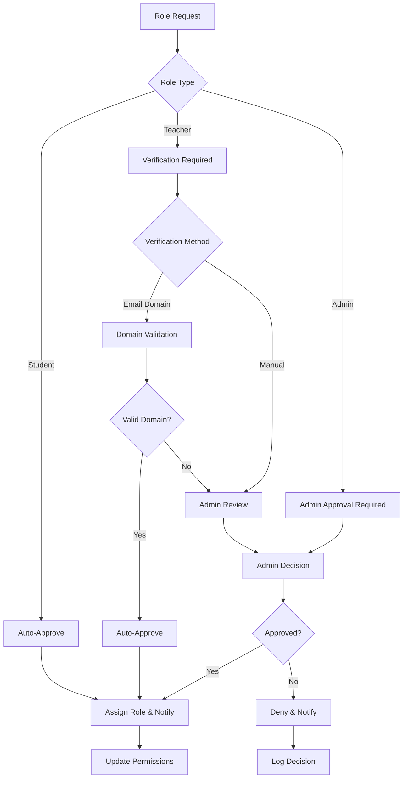
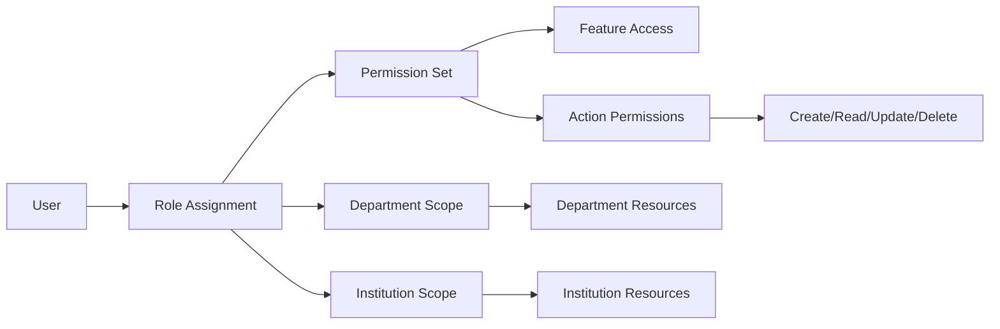

# Design Document

## Overview

The Role Assignment Flow will implement a comprehensive role management system that handles role verification, approval workflows, permission management, and audit trails. The design integrates with the existing authentication system and extends the user onboarding flow to include proper role validation and assignment processes.

## Architecture

### Role Management Flow


### Permission System Architecture


## Components and Interfaces

### Core Components

#### RoleManager
```typescript
interface RoleManager {
  requestRole(userId: string, roleType: UserRole, justification?: string): Promise<RoleRequest>;
  approveRole(requestId: string, approverId: string, notes?: string): Promise<void>;
  denyRole(requestId: string, approverId: string, reason: string): Promise<void>;
  changeRole(userId: string, newRole: UserRole, approverId: string): Promise<void>;
  assignTemporaryRole(userId: string, role: UserRole, expiresAt: Date): Promise<void>;
  revokeRole(userId: string, roleToRevoke: UserRole): Promise<void>;
}
```

#### PermissionChecker
```typescript
interface PermissionChecker {
  hasPermission(userId: string, permission: Permission): Promise<boolean>;
  canAccessResource(userId: string, resourceId: string, action: Action): Promise<boolean>;
  getUserPermissions(userId: string): Promise<Permission[]>;
  checkBulkPermissions(userId: string, permissions: Permission[]): Promise<PermissionResult[]>;
}
```

#### RoleVerificationService
```typescript
interface RoleVerificationService {
  verifyEmailDomain(email: string, institutionId: string): Promise<boolean>;
  verifyInstitutionalAffiliation(userId: string, institutionId: string): Promise<VerificationResult>;
  requestManualVerification(userId: string, evidence: VerificationEvidence): Promise<void>;
  processVerificationResult(verificationId: string, result: boolean): Promise<void>;
}
```

### Data Models

#### Enhanced User Role System
```typescript
enum UserRole {
  STUDENT = 'student',
  TEACHER = 'teacher',
  DEPARTMENT_ADMIN = 'department_admin',
  INSTITUTION_ADMIN = 'institution_admin',
  SYSTEM_ADMIN = 'system_admin'
}

enum RoleStatus {
  ACTIVE = 'active',
  PENDING = 'pending',
  SUSPENDED = 'suspended',
  EXPIRED = 'expired'
}

interface UserRoleAssignment {
  id: string;
  userId: string;
  role: UserRole;
  status: RoleStatus;
  assignedBy: string;
  assignedAt: Date;
  expiresAt?: Date;
  departmentId?: string;
  institutionId: string;
  isTemporary: boolean;
  metadata: Record<string, any>;
}
```

#### Role Request System
```typescript
interface RoleRequest {
  id: string;
  userId: string;
  requestedRole: UserRole;
  currentRole?: UserRole;
  justification: string;
  status: 'pending' | 'approved' | 'denied' | 'expired';
  requestedAt: Date;
  reviewedAt?: Date;
  reviewedBy?: string;
  reviewNotes?: string;
  verificationMethod: 'email_domain' | 'manual_review' | 'admin_approval';
  institutionId: string;
  departmentId?: string;
}
```

#### Permission System
```typescript
interface Permission {
  id: string;
  name: string;
  description: string;
  category: 'content' | 'user_management' | 'analytics' | 'system';
  scope: 'self' | 'department' | 'institution' | 'system';
}

interface RolePermission {
  roleType: UserRole;
  permissions: Permission[];
  conditions?: PermissionCondition[];
}

interface PermissionCondition {
  type: 'department_match' | 'institution_match' | 'resource_owner' | 'time_based';
  parameters: Record<string, any>;
}
```

### Database Schema

#### Role Management Tables
```sql
-- Enhanced users table
ALTER TABLE users ADD COLUMN primary_role VARCHAR DEFAULT 'student';
ALTER TABLE users ADD COLUMN role_status VARCHAR DEFAULT 'active';
ALTER TABLE users ADD COLUMN role_verified_at TIMESTAMP;
ALTER TABLE users ADD COLUMN role_assigned_by UUID REFERENCES users(id);

-- User role assignments (supports multiple roles)
CREATE TABLE user_role_assignments (
  id UUID PRIMARY KEY DEFAULT gen_random_uuid(),
  user_id UUID REFERENCES users(id) NOT NULL,
  role VARCHAR NOT NULL,
  status VARCHAR DEFAULT 'active',
  assigned_by UUID REFERENCES users(id),
  assigned_at TIMESTAMP DEFAULT NOW(),
  expires_at TIMESTAMP,
  department_id UUID REFERENCES departments(id),
  institution_id UUID REFERENCES institutions(id) NOT NULL,
  is_temporary BOOLEAN DEFAULT FALSE,
  metadata JSONB DEFAULT '{}',
  created_at TIMESTAMP DEFAULT NOW(),
  updated_at TIMESTAMP DEFAULT NOW()
);

-- Role requests
CREATE TABLE role_requests (
  id UUID PRIMARY KEY DEFAULT gen_random_uuid(),
  user_id UUID REFERENCES users(id) NOT NULL,
  requested_role VARCHAR NOT NULL,
  current_role VARCHAR,
  justification TEXT,
  status VARCHAR DEFAULT 'pending',
  requested_at TIMESTAMP DEFAULT NOW(),
  reviewed_at TIMESTAMP,
  reviewed_by UUID REFERENCES users(id),
  review_notes TEXT,
  verification_method VARCHAR,
  institution_id UUID REFERENCES institutions(id) NOT NULL,
  department_id UUID REFERENCES departments(id),
  expires_at TIMESTAMP DEFAULT (NOW() + INTERVAL '7 days')
);

-- Role change audit log
CREATE TABLE role_audit_log (
  id UUID PRIMARY KEY DEFAULT gen_random_uuid(),
  user_id UUID REFERENCES users(id) NOT NULL,
  action VARCHAR NOT NULL, -- 'assigned', 'revoked', 'changed', 'expired'
  old_role VARCHAR,
  new_role VARCHAR,
  changed_by UUID REFERENCES users(id),
  reason TEXT,
  timestamp TIMESTAMP DEFAULT NOW(),
  institution_id UUID REFERENCES institutions(id),
  department_id UUID REFERENCES departments(id),
  metadata JSONB DEFAULT '{}'
);

-- Permissions system
CREATE TABLE permissions (
  id UUID PRIMARY KEY DEFAULT gen_random_uuid(),
  name VARCHAR UNIQUE NOT NULL,
  description TEXT,
  category VARCHAR NOT NULL,
  scope VARCHAR NOT NULL,
  created_at TIMESTAMP DEFAULT NOW()
);

CREATE TABLE role_permissions (
  id UUID PRIMARY KEY DEFAULT gen_random_uuid(),
  role VARCHAR NOT NULL,
  permission_id UUID REFERENCES permissions(id),
  conditions JSONB DEFAULT '{}',
  created_at TIMESTAMP DEFAULT NOW()
);

-- Institution domain verification
CREATE TABLE institution_domains (
  id UUID PRIMARY KEY DEFAULT gen_random_uuid(),
  institution_id UUID REFERENCES institutions(id) NOT NULL,
  domain VARCHAR NOT NULL,
  verified BOOLEAN DEFAULT FALSE,
  auto_approve_roles VARCHAR[] DEFAULT '{}',
  created_at TIMESTAMP DEFAULT NOW()
);
```

### API Design

#### Role Management Endpoints
```typescript
// Role requests
POST /api/roles/request
PUT /api/roles/requests/:id/approve
PUT /api/roles/requests/:id/deny
GET /api/roles/requests (with filtering)

// Role assignments
POST /api/roles/assign
PUT /api/roles/:userId/change
DELETE /api/roles/:userId/revoke
POST /api/roles/bulk-assign

// Permissions
GET /api/permissions/user/:userId
GET /api/permissions/check
POST /api/permissions/bulk-check

// Verification
POST /api/roles/verify-domain
POST /api/roles/verify-manual
GET /api/roles/verification-status/:userId

// Audit
GET /api/roles/audit
GET /api/roles/audit/export
```

## Error Handling

### Validation Strategy
- Role request validation with business rule enforcement
- Permission check caching with invalidation on role changes
- Domain verification with fallback to manual review
- Bulk operation validation with partial success handling

### Security Measures
- Role escalation prevention through approval workflows
- Audit logging for all role changes
- Rate limiting on role requests
- Permission check optimization to prevent performance issues

### Failure Recovery
- Automatic role expiration handling
- Failed verification retry mechanisms
- Graceful degradation when permission service is unavailable
- Rollback capabilities for bulk operations

## Testing Strategy

### Unit Testing
- Role assignment logic validation
- Permission checking algorithms
- Domain verification functions
- Audit logging accuracy

### Integration Testing
- End-to-end role request workflows
- Permission system integration with existing features
- Bulk assignment processing
- Email notification delivery

### Security Testing
- Role escalation attack prevention
- Permission bypass attempt detection
- Audit log tampering prevention
- Access control validation

### Performance Testing
- Permission checking under load
- Bulk role assignment scalability
- Audit log query performance
- Cache effectiveness validation

## Implementation Considerations

### Migration Strategy
- Gradual rollout with existing role system compatibility
- Data migration for current user roles
- Permission mapping from current implicit permissions
- Backward compatibility during transition period

### Monitoring and Alerting
- Role assignment success/failure rates
- Permission check performance metrics
- Suspicious role change detection
- Audit log completeness verification

### Scalability Planning
- Permission check caching strategy
- Audit log archival and retention
- Bulk operation queue management
- Database indexing optimization

### User Experience
- Clear role status indicators
- Intuitive permission explanations
- Streamlined approval workflows
- Mobile-responsive admin interfaces