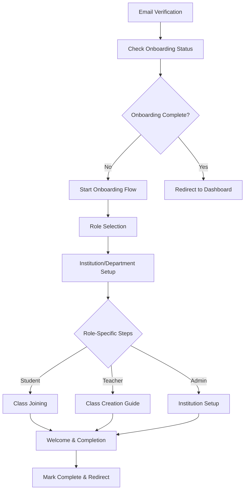

# Design Document

## Overview

The User Onboarding Flow will be implemented as a multi-step guided process that activates immediately after email verification. The design leverages the existing Supabase authentication system and extends the current user profile management to include onboarding state tracking and role-based flow customization.

## Architecture

### High-Level Flow


### Integration Points
- **Authentication**: Extends existing Supabase auth flow in `contexts/auth-context.tsx`
- **User Management**: Builds on current user profile system seen in dashboard layouts
- **Database**: Adds onboarding tracking to existing user tables
- **Routing**: Integrates with Next.js App Router structure

## Components and Interfaces

### Core Components

#### OnboardingProvider
```typescript
interface OnboardingContextType {
  currentStep: number;
  totalSteps: number;
  onboardingData: OnboardingData;
  updateOnboardingData: (data: Partial<OnboardingData>) => void;
  nextStep: () => void;
  previousStep: () => void;
  skipStep: () => void;
  completeOnboarding: () => Promise<void>;
}
```

#### OnboardingLayout
- Wraps all onboarding steps
- Provides consistent navigation and progress indication
- Handles step transitions and data persistence

#### Step Components
- `RoleSelectionStep`: Role picker with descriptions
- `InstitutionSetupStep`: Institution search and department selection
- `StudentClassJoinStep`: Class code entry and joining
- `TeacherClassGuideStep`: Optional class creation walkthrough
- `AdminInstitutionSetupStep`: New institution creation
- `WelcomeStep`: Personalized completion screen

### Data Models

#### OnboardingData Interface
```typescript
interface OnboardingData {
  userId: string;
  role: 'student' | 'teacher' | 'institution_admin' | 'department_admin';
  institutionId?: string;
  departmentId?: string;
  classIds?: string[];
  skippedSteps: string[];
  completedAt?: Date;
  currentStep: number;
}
```

#### Database Schema Extensions
```sql
-- Extend users table
ALTER TABLE users ADD COLUMN onboarding_completed BOOLEAN DEFAULT FALSE;
ALTER TABLE users ADD COLUMN onboarding_data JSONB;
ALTER TABLE users ADD COLUMN onboarding_step INTEGER DEFAULT 0;

-- New institutions table
CREATE TABLE institutions (
  id UUID PRIMARY KEY DEFAULT gen_random_uuid(),
  name VARCHAR NOT NULL,
  domain VARCHAR,
  created_at TIMESTAMP DEFAULT NOW(),
  status VARCHAR DEFAULT 'active'
);

-- New departments table  
CREATE TABLE departments (
  id UUID PRIMARY KEY DEFAULT gen_random_uuid(),
  institution_id UUID REFERENCES institutions(id),
  name VARCHAR NOT NULL,
  created_at TIMESTAMP DEFAULT NOW()
);

-- Update user-institution relationships
ALTER TABLE users ADD COLUMN institution_id UUID REFERENCES institutions(id);
ALTER TABLE users ADD COLUMN department_id UUID REFERENCES departments(id);
```

### API Endpoints

#### Onboarding Management
- `POST /api/onboarding/start` - Initialize onboarding session
- `PUT /api/onboarding/update` - Update onboarding progress
- `POST /api/onboarding/complete` - Mark onboarding as complete
- `GET /api/onboarding/status` - Get current onboarding state

#### Institution Management
- `GET /api/institutions/search` - Search institutions with autocomplete
- `POST /api/institutions/request` - Request new institution creation
- `GET /api/institutions/:id/departments` - Get departments for institution

## Error Handling

### Validation Strategy
- Client-side validation for immediate feedback
- Server-side validation for data integrity
- Progressive enhancement for accessibility

### Error Recovery
- Auto-save onboarding progress to prevent data loss
- Graceful degradation when external services fail
- Clear error messages with actionable next steps

### Fallback Mechanisms
- Skip functionality for non-critical steps
- Manual completion options for edge cases
- Admin override capabilities for stuck users

## Testing Strategy

### Unit Testing
- Component rendering and interaction tests
- Onboarding context state management tests
- API endpoint validation tests
- Database operation tests

### Integration Testing
- Complete onboarding flow end-to-end tests
- Role-specific path validation
- Database transaction integrity tests
- Authentication integration tests

### User Experience Testing
- Accessibility compliance testing
- Mobile responsiveness validation
- Performance testing for large institution lists
- Cross-browser compatibility testing

### Test Data Management
- Mock institution and department data
- Test user accounts for each role type
- Automated test data cleanup
- Staging environment with realistic data volumes

## Implementation Phases

### Phase 1: Core Infrastructure
- Database schema updates
- Basic onboarding context and provider
- Route protection and redirection logic
- Progress tracking and persistence

### Phase 2: Step Components
- Role selection interface
- Institution search and selection
- Department assignment functionality
- Basic navigation and progress indication

### Phase 3: Role-Specific Flows
- Student class joining workflow
- Teacher class creation guidance
- Admin institution setup process
- Personalized welcome screens

### Phase 4: Enhancement and Polish
- Advanced search and filtering
- Analytics and completion tracking
- Performance optimization
- Accessibility improvements

## Security Considerations

### Data Protection
- Encrypt sensitive onboarding data in transit and at rest
- Implement proper access controls for institution data
- Audit logging for onboarding completion events
- GDPR compliance for user data collection

### Authentication Integration
- Leverage existing Supabase RLS policies
- Ensure onboarding data is user-scoped
- Validate user permissions for institution access
- Secure API endpoints with proper authentication

### Input Validation
- Sanitize all user inputs
- Validate institution and department selections
- Prevent unauthorized role assignments
- Rate limiting for search endpoints